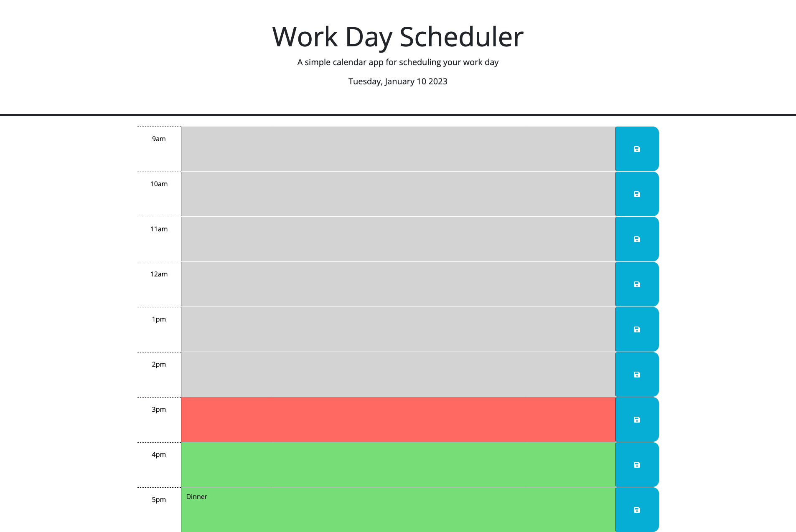

# Daily Calendar

## Links

[Click to view the live site](https://zachshouts.github.io/daily-calendar/)

## Description 

During this unit's challenge we showcased the following

* Implemented dayjs to receive, format, and render the current date/time

* Utilized bootstrap to style HTML elements

* Utilized JQuery to perform all JS tasks

* Implemented array mapping to increase efficiency of updating local storage objects